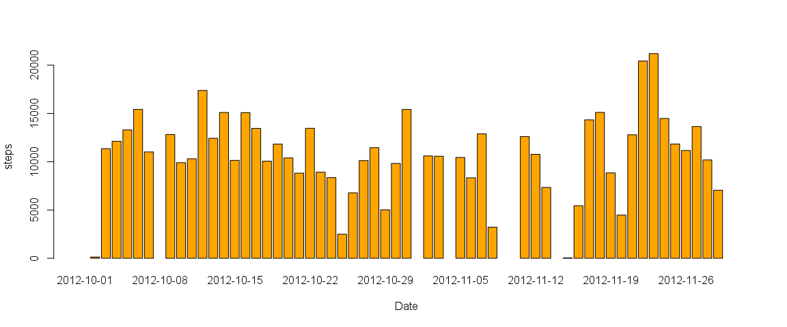
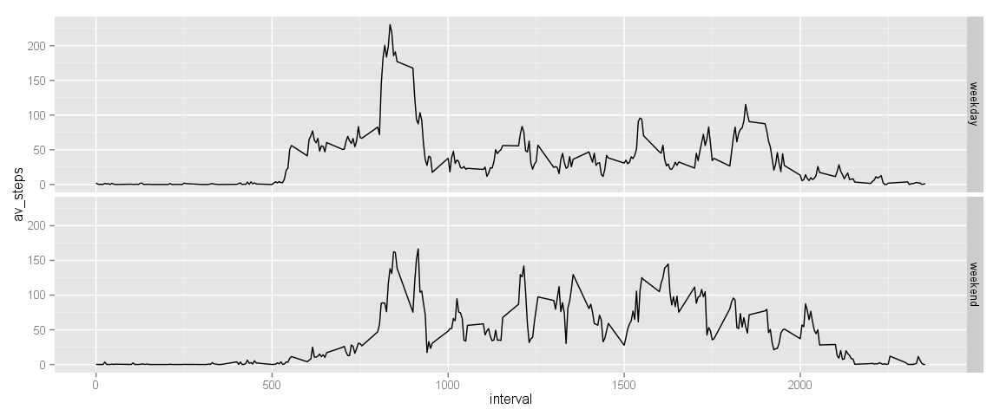

# Reproducible Research: Peer Assessment 1

______________________________________

## Loading and preprocessing the data
______________________________________

First thing to do is read the "csv" file where data is contained.
As options to be considered, we know that...

* Data is "comma separated", 

* There is a first row header line

* The NA is declared with the "NA" strings


```r
activity <-read.csv(file="./activity.csv", sep=",",header=TRUE,na.strings="NA")
```

The dataframe is stored into *activity* variable, but to do the calculations we are not going to 
eliminate the NAs from the dataframe.


Finally to end the pre-processing of the data, we convert the dates into factor format as originally is an integer.

## What is mean total number of steps taken per day?
For analysing the total number of steps taken each day, we are representing it with an hystogram chart, so that apply the function *sum* so the factorized dates.


```r
hist_data <-with(activity,tapply(steps, date, sum ))

hist_df<-data.frame(hist_data)  
hist_df$date <- rownames(hist_df)
```

We notice that there are some values associated to certain days that are not valid (NAs). For the plot purpose, as the  axix are dates and to keep the time scale coherent, we are ploting  all days even though there are some void

The plot of the accumulated steps per day is as follows...


```r
barplot(hist_df$hist_data, names.arg=hist_df$date, xlab="Date", ylab="steps", col="orange", axes=TRUE)
```

 

To calculate the Average and Median, we must eliminate the NAs form the dataframe...


```r
hist_df_wo_NA<-hist_df[!is.na(hist_df[,1]),]
data_average <- as.integer(mean(hist_df_wo_NA$hist_data))
data_median <- median(hist_df_wo_NA$hist_data)
```

The Average is so: **10766** 

and the Median is: **10765**


## What is the average daily activity pattern?

We calculate the average of all the data sharing the same *interval* value and plot a line graphic representing its time profile along the day...
for that we must eliminate the NA values cleaning the data...


```r
is_NA<- is.na(activity$steps)
clean_activity <- activity[!is_NA,]
```


```r
dailypatternaverage <- with(clean_activity,tapply(steps,interval,mean))
dailypatternaverage <- data.frame(dailypatternaverage)
dailypatternaverage$interval <- row.names(dailypatternaverage)
names(dailypatternaverage)[1]<-"av_steps"
```

Times series plot, "l"type , five minutes interval (x-axis) and average steps taken across all day (y-axis)


```r
par(lwd=2, col="orange",col.sub="blue",col.axis="black", fg="black")
plot(dailypatternaverage$interval, dailypatternaverage$av_steps, type="l", main=" Average daily pattern",
     xlab="Time", ylab="Average steps",) 
```

 


So we can see that the maximum average number of steps per 5 min interval is 


```r
maxavinterval <- max(dailypatternaverage$av_steps,na.rm=TRUE)
maxinterval <-  dailypatternaverage$interval[dailypatternaverage[,1]==max(dailypatternaverage[,1],na.rm=TRUE)]
```


* The 5 minute interval, on average across all the days in the dataset that contains the maximum number of steps is number **835** , 
which registers an average (rounded to 2 digits) of **206.17** steps.


## Imputing missing values

###1) The missing values encountered in the data set are the following


```r
steps_missing <- is.na(activity$steps)
dates_missing <- is.na(activity$date)
interval_missing <- is.na(activity$interval)
combined_missing <- (steps_missing | dates_missing | interval_missing)
```

- Number of cases in which *steps* field is a NA is: *2304*
- Number of cases in which *dates* field is a NA is: *0*
- Number of cases in which *interval* filed is a NA is *0*
- Number of rows in which at least one of the fields is a NA is *2304*

###2) Strategy to fill al the missing variables in the dataset

As can be seen, just the *steps* field has missing values.
To complete all the missing data in the dataset trying to avoid the influence on the data, we are going to use as criteria to fill that inteerval with the mean steps for that 5 minute interval all along the data set..


```r
for(i in 1:dim(activity)[1]){
        if(is.na(activity$steps[i])) activity$steps[i]=dailypatternaverage$av_steps[dailypatternaverage$interval==activity$interval[i]]
        }
```

We check that the values have been filled as ...


```r
steps_missing_verification <- is.na(activity$steps)
```

The actual missing values figure is  *0*

also we calculate the new dataframe of average steps profile and deduce from the first one to see if the averages have been kept...


```r
dailypatternaverage_verification <- with(activity,tapply(steps,interval,mean))
dailypatternaverage_verification <- data.frame(dailypatternaverage_verification)
dailypatternaverage_verification$interval <- row.names(dailypatternaverage_verification)
names(dailypatternaverage_verification)[1]<-"av_steps"

check_vector <- dailypatternaverage$av_steps-dailypatternaverage_verification$av_steps
check_control <- sum(check_vector^2)
```

*The original pattern profile  (with NAs) deducing the new profile in which the NA values have been changed by the average value in that interval is the **0** vector, so the operation has been successful.*


**Now we construct an histogram with the corrected dataset in which the interval profile average has been used to substitute the NAs..**


```r
hist_data2 <-with(activity,tapply(steps, date, sum ))
hist_df2<-data.frame(hist_data2)  
hist_df2$date <- rownames(hist_df2)
```
The plot of the accumulated steps per day is as follows...


```r
barplot(hist_df2$hist_data2, names.arg=hist_df2$date, xlab="Date", ylab="steps", col="orange", axes=TRUE)
```

 

To calculate the Average and Median, we must eliminate the NAs form the dataframe...


```r
data_average2 <- as.integer(mean(hist_df2$hist_data2))
data_median2 <- median(hist_df2$hist_data2)
```

The Average is so: **10766** 

and the Median is: **10766**

In the original case, not having changed the NAs with values the results were...

The Average was so: **10766** 

and the Median was: **10765**


_____

## Are there differences in activity patterns between weekdays and weekends?

To determine the diferences in patterns between activity patterns obtained in weekdays or in weekends, we must convert the *date* column into a date format so that we can determine which day of the week the register has been taken...


```r
activity$weekday <-strptime(activity$date, format="%Y-%m-%d")
activity$weekday <- weekdays(activity$weekday)
for (j in 1:(dim(activity)[1])) {
        if(activity$weekday[j] == "Monday") activity$daytype[j] <- "weekday" 
        if(activity$weekday[j] == "Tuesday") activity$daytype[j] <- "weekday" 
        if(activity$weekday[j] == "Wednesday") activity$daytype[j] <- "weekday" 
        if(activity$weekday[j] == "Thursday") activity$daytype[j] <- "weekday" 
        if(activity$weekday[j] == "Friday") activity$daytype[j] <- "weekday" 
        if(activity$weekday[j] == "Saturday") activity$daytype[j] <- "weekend"
        if(activity$weekday[j] == "Sunday") activity$daytype[j] <- "weekend"      
              
}
```
Construct the data frames that rflect the pattern average of steps in each case, ie: weekdays or wekkends...


```r
weekdaypatternaverage <- with(activity[activity$daytype=="weekday",],tapply(steps,interval,mean))
weekdaypatternaverage <- data.frame(weekdaypatternaverage)
weekdaypatternaverage$interval <- row.names(weekdaypatternaverage)
names(weekdaypatternaverage)[1]<-"av_steps"
```


```r
weekendpatternaverage <- with(activity[activity$daytype=="weekend",],tapply(steps,interval,mean))
weekendpatternaverage <- data.frame(weekendpatternaverage)
weekendpatternaverage$interval <- row.names(weekendpatternaverage)
names(weekendpatternaverage)[1]<-"av_steps"
```


Plot in a frame the two patterns, for that we merge the two dataframes into one 


```r
weekendpatternaverage$type <- "weekend"
weekdaypatternaverage$type <- "weekday"
mergedpatterns <-rbind(weekdaypatternaverage,weekendpatternaverage)
mergedpatterns$interval <- as.integer(mergedpatterns$interval)
```

And finaly plot the two subsets one on top of the other.
It can be seen that on weekends people wake up later and go to bed also later.


```r
library("ggplot2")
qplot(x=interval, y=av_steps, data=mergedpatterns, facets=type~., geom="line",)
```

 


